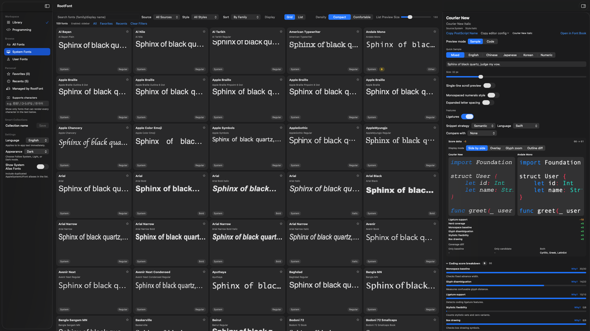
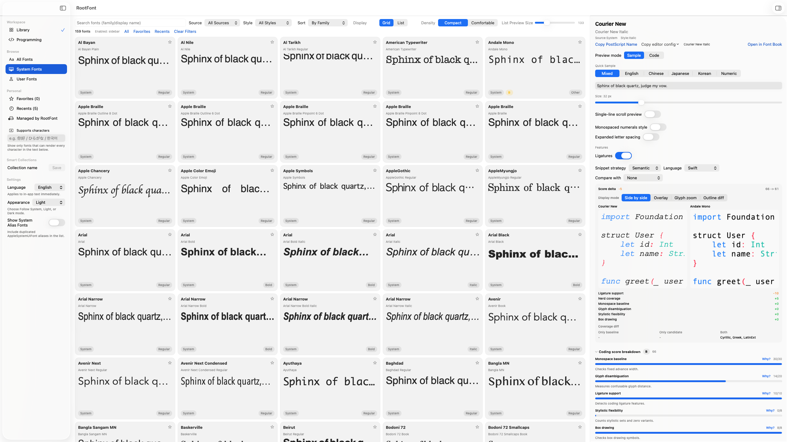

# RootFont


The native font manager for designers and programmers on macOS.

## Status

**Current build:** `v0.3.0-alpha (5)`  
**Platform:** macOS 14+  
**Bundle ID:** `com.rootfont.app`

RootFont is currently in active alpha development.

## What's New in v0.3.0-alpha (5)

RootFont v0.3.0-alpha is the programming-font release on top of v0.2.0-beta. This build adds a dedicated Programming workspace, a full suitability-scoring pipeline, multi-mode font comparison, 12-language code preview, OpenType controls in the inspector, font activation/install flows, and one-click editor config export. Startup is faster thanks to staged catalog loading and shared font-URL caching.

### Programming workspace

- Sidebar **Library / Programming** module switch; Programming mode scopes to monospaced fonts and sorts by programming fit by default.
- New sidebar filters: **Recommended for code**, **Avoid for code**, and **Managed by RootFont**.
- **Programming suitability scoring** (S / A / B / C / NR) across ten weighted factors: monospace baseline, glyph disambiguation, ligatures, stylistic flexibility, box drawing, Powerline, Nerd Font, variable font, language coverage, and weight variety.
- Score breakdown with per-factor progress bars, grade badges, and **Why** popovers; low-grade fonts show improvement hints.
- Configurable score weights in Settings: **Default**, **Terminal Heavy**, **IDE Heavy**, and **Minimalist** presets plus ten independent sliders.
- Persisted score cache at `~/Library/Application Support/RootFont/scores.json`, invalidated on font file changes.

### Compare & code preview

- **Font compare** in the preview panel: side-by-side, overlay (opacity + visibility), glyph zoom, and outline-diff modes.
- Score delta, top factor deltas, and language-coverage diff between baseline and candidate fonts.
- **Sample / Code** preview surface toggle with mini syntax highlighting for 12 languages (Swift, TypeScript, JavaScript, Python, Rust, Go, Java, Kotlin, SQL, JSON, Shell, CSS).
- **Semantic** and **Native** code-snippet strategies per language via `SnippetCatalog`.

### OpenType & workflow

- Live OpenType binding: ligatures, slashed/dotted zero, and stylistic sets in preview; preferences persist per font.
- **Font activation**: session activate, user-scope install to `~/Library/Fonts/RootFont/`, uninstall, and startup reconcile.
- One-click editor config copy for **VS Code**, **Cursor**, **Alacritty**, **Kitty**, **Warp**, and **Zed**.
- Preview header actions: copy PostScript name, open in Font Book, open managed-fonts folder.

### Performance & developer experience

- **Staged catalog loading** with two-phase progress UI (load fonts / enrich analysis); partial results appear before enrichment finishes.
- **FontURLIndex** caches system font URL enumeration across load, activation, and filtering.
- **FontPreviewView** split into focused subviews; programming grade badges on grid cards.
- Expanded hit targets in sidebar and font list for more reliable row selection.
- GitHub Actions CI on `macos-14` (`swift build`, `swift test`, `check-l10n.py`, `check-version.py`); ~80 tests across 16 suites including scoring, activation, and compare coverage.

## Screenshots (v0.3.0-alpha)

<p align="center">
  
  
</p>

> Screenshots follow the `screenshots/v<version>/NN-<slug>.png` convention.
> Validate locally with `python3 scripts/optimize-screenshots.py --check`
> before committing new images.

## Features

- Browse installed fonts on macOS with grid/list views, search, and glyph-coverage filter
- Preview fonts with custom text, size, and quick-sample presets
- Favorites, recents, smart collections, and drag-and-drop import
- Programming workspace with scoring, compare, code preview, and OpenType controls
- Session activation, user install, and editor config export
- Localized UI (English, Simplified Chinese, Traditional Chinese, Japanese, Korean)

## Localization

- Supported languages: `en`, `zh-Hans`, `zh-Hant`, `ja`, `ko`
- Quick Sample presets include dedicated Japanese and Korean text
- When a selected font does not fully support current preview text, RootFont shows a fallback warning

## Quick Start

### Requirements

- **macOS 14+** (Apple Silicon or Intel)
- **Xcode 15+** with the macOS SDK — the full app from the App Store or
  [developer.apple.com/xcode](https://developer.apple.com/xcode/)
- **Swift 6.0+** (`Package.swift` uses `swift-tools-version: 6.0`). Swift
  **6.2+** is recommended; newer toolchains apply stricter Swift
  concurrency checks (see [issue #56](https://github.com/rootfont/rootfont/issues/56)).

RootFont is a **macOS-only** SwiftPM project. Building, running, and testing
on Linux or with Command Line Tools alone is **not supported**.

### Toolchain setup

Use the **Xcode** toolchain, not standalone Command Line Tools:

```bash
xcode-select -p
# Expected: /Applications/Xcode.app/Contents/Developer

# If you see /Library/Developer/CommandLineTools instead:
sudo xcode-select -s /Applications/Xcode.app/Contents/Developer
```

Verify Swift and XCTest:

```bash
swift --version
xcrun swift -e 'import XCTest; print("XCTest OK")'
```

`swift test` requires **XCTest** from Xcode. If you see
`no such module 'XCTest'`, switch `xcode-select` as above and open Xcode
once to finish component installation.

### Run

```bash
swift run RootFontApp
```

### Run Tests

```bash
swift test
```

### Optional: git hooks

```bash
bash scripts/install-git-hooks.sh
```

Hooks run localization and version-metadata checks on commit when relevant files are staged.

## Contributing

Contributions are welcome. See [CONTRIBUTING.md](CONTRIBUTING.md) for details.

## License

RootFont is licensed under Apache License 2.0. See [LICENSE](LICENSE).

## Third-Party Notices

See [NOTICE](NOTICE) for third-party attribution requirements.

## Code of Conduct

This project follows the Contributor Covenant. See [CODE_OF_CONDUCT.md](CODE_OF_CONDUCT.md).
